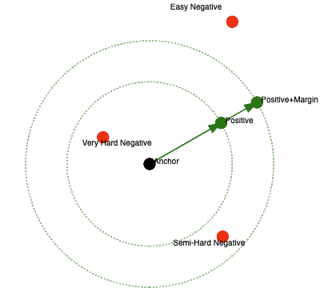

# DINOv2 Fine-tuning Details

## 1. Model Architecture

```
Image Input (224×224)
    ↓
DINOv2 Backbone (ViT-B/14)
    ↓ (768)
Feature Processor
    ├─ BatchNorm1d(768)
    └─ Dropout(0.2)
    ↓
Projection Head
    ├─ Linear(768 → 1024)
    ├─ ReLU
    ├─ Dropout(0.3)
    ├─ Linear(1024 → 1280)
    └─ BatchNorm1d(1280)
    ↓
L2 Normalization
    ↓
Embedding Output (1280)
```

### [DINOv2](https://github.com/facebookresearch/dinov2) Backbone
Pre-trained Vision Transformer ViT-B/14.

### Feature Processor
Uses BatchNorm1d to stabilize feature distributions and Dropout to prevent overfitting.

### Projection Head
Employs Linear and ReLU layers to learn both linear and non-linear features, with BatchNorm1d and Dropout to stabilize features and prevent overfitting.

### L2 Normalization
Normalizes vectors to the unit hypersphere.

## 2. Training Strategy

### Phase 1: Train Only Projection Head and Feature Processor (20 Epochs)
- Freeze Backbone
- Learning Rate: $3 \times 10^{-4}$

### Phase 2: Unfreeze Last 2 Blocks of Backbone (15 Epochs)
- Learning Rate: $8 \times 10^{-5}$

### Phase 3: Unfreeze Last 4 Blocks of Backbone (12 Epochs)
- Learning Rate: $3 \times 10^{-5}$

## 3. [Triplet Loss](https://en.wikipedia.org/wiki/Triplet_loss)


$$ L(A, P, N) = Max(\parallel f(A) - f(P) \parallel ^ 2 - \parallel f(A) - f(N) \parallel ^ 2 + \alpha, 0) $$

Formula Derivation:

We want AP distance to be as small as possible and AN distance to be as large as possible, so

$$ \parallel f(A) - f(P) \parallel ^ 2 \ \le \ \parallel f(A) - f(N) \parallel ^ 2 $$

$$ \parallel f(A) - f(P) \parallel ^ 2 \ - \ \parallel f(A) - f(N) \parallel ^ 2 \le 0 $$

However, this might cause all output features to become zero, or all distance differences to be zero. Therefore, we typically add a margin $\alpha$ to enforce separation:

$$ \parallel f(A) - f(P) \parallel ^ 2 \ - \ \parallel f(A) - f(N) \parallel ^ 2 \le - \alpha $$

$$ \parallel f(A) - f(P) \parallel ^ 2 \ - \ \parallel f(A) - f(N) \parallel ^ 2 + \alpha \le 0 $$

**Parameters:**

$Margin(\alpha) = 0.3$

Mining Strategy: **Hard** ($AP distance - AN distance + \alpha > 0$)

> Three types of triplets:
> 1. Easy Triplets: AN distance is greater than AP distance, and the difference exceeds the margin. A and P are already close enough and sufficiently far from N.
> 2. Hard Triplets: AP distance is greater than AN distance.
> 3. Semi-hard Triplets: AN distance is greater than AP distance, but the difference is smaller than the margin, so the formula above is not yet satisfied.



## 4. Dataset Split

| Data Set | Proportion |
| --- | --- |
| Training Set | 70% |
| Validation Set | 15% |
| Test Set | 15% |

## 5. Optimization

### 5.1 Mini-batch and Accumulation Steps

Each mini-batch size is 16, with gradients accumulated over 8 mini-batches before updating weights.

Therefore, the effective batch size is 128.

**Parameters:**

$batch\ size = 16$

$accumulation\ steps = 8$

### 5.2 Early Stopping

Training stops for the current phase if validation loss does not improve for several consecutive epochs.

**Parameters:**

$patience = 6$

$delta = 0.0005$

### 5.3 Gradient Clipping

Uses clip-by-norm to prevent gradient explosion.

**Parameters:**

$max\_norm = 1.0$

### 5.4 ReduceLROnPlateau

If validation loss does not improve for 3 consecutive epochs, the learning rate is halved.

**Parameters:**

$factor = 0.5$

$patience = 3$

$min\_lr = 10^{-6}$

### 5.5 Weight Decay

Maintains smaller weights to avoid overfitting.

Standard gradient descent:

$$ w_{new} = w_{old} - learning\ rate \times gradient $$

With weight decay:

$$ w_{new} = w_{old} - learning\ rate \times gradient - learning\ rate \times \lambda \times w_{old} $$

This can be rearranged as:

$$ w_{new} = (1 - learning\ rate \times \lambda) \times w_{old} - learning\ rate \times gradient $$

**Parameters:**

$\lambda = 10^{-4}$

## 6. Variables and Test Results

| Model Name | Batch Size | Same Area Negative | Box Size | TestSet Accuracy | TestSet Loss | N-Benchmark Avg | N-Benchmark A37 | N-Benchmark A38 | N-Benchmark A39 | N-Benchmark A40 | Comment |
| --- | --- | --- | --- | --- | --- | --- | --- | --- | --- | --- | --- |
| Pre-trained Weight | <hr> | <hr> | bbox | <hr> | <hr> | 29.48% | 28.12% | 35.48% | 29.63% | 24.32% | <hr> |
| 20250812_152526 | 32 | ❌ | bbox | 92.6% | 0.1659 | 48.25% | 50.00% | 51.61% | 48.15% | 43.24% | <hr> |
| 20251007_133126 | 32 | ✅ | bbox | 88.8% | 0.2523 | 39.32% | 46.88% | 41.94% | 33.33% | 35.14% | <hr> |
| 20251008_094017 | 16 | ✅ | bbox | 90.4% | 0.1636 | 40.19% | 37.50% | 48.39% | 37.04% | 37.84% | <hr> |
| 20251008_234015 | 64 | ✅ | bbox | N/A | N/A | N/A | N/A | N/A | N/A | N/A | CUDA out of memory |
| 20251014_183603 | 16 | ❌ | bbox | 92.8% | 0.1012 | 40.97% | 37.50% | 38.71% | 44.44% | 43.24% | <hr> |
| Pre-trained Weight | <hr> | <hr> | whole image | <hr> | <hr> | 50.88% | 34.38% | 54.84% | 62.96% | 51.35% | <hr> |
| **20251015_165008 (Final Model)** | 16 | ✅ | whole image | 92.7% | 0.1330 | 64.43% | 62.50% | 61.29% | 55.56% | 78.38% | <hr> |
| 20251016_133229 | 16 | ❌ | whole image | 97.9% | 0.0429 | 63.31% | 56.25% | 58.06% | 74.07% | 64.86% | <hr> |

> `Same Area Negative`: Only use corals from the same area as the Anchor and Positive as Negatives.
> `N-Benchmark(Nearest Benchmark)`: Matching accuracy between 2022 and 2023 for Tag areas 37-40.

## Reference

[FaceNet: A Unified Embedding for Face Recognition and Clustering](https://www.cv-foundation.org/openaccess/content_cvpr_2015/papers/Schroff_FaceNet_A_Unified_2015_CVPR_paper.pdf)

[DINOv2 GitHub Repository](https://github.com/facebookresearch/dinov2)
